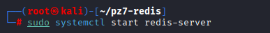
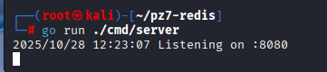
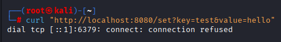
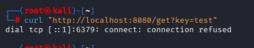
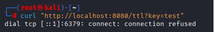
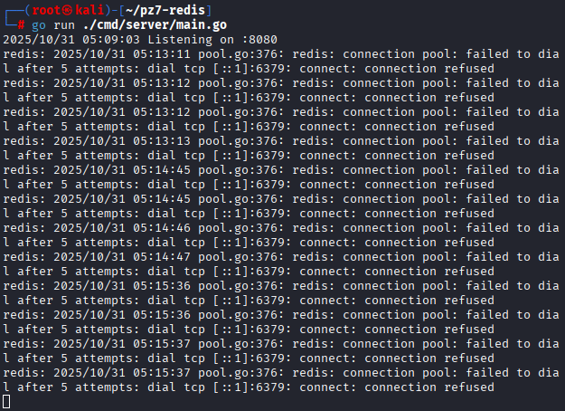

# практическа работа 7
## ЭФМО-02-25 Фомичев Александр Сергеевич
### Структура проекта:
```
pz7-redis/
  cmd/
    server/
      main.go
  go.mod
  internal/
    cache/
      cache.go

```
## Цели занятия
-	Освоить базовые операции работы с Redis из Go-приложения.
-	Научиться использовать команды SET, GET, задавать время жизни ключей (TTL).
-	Реализовать кэширование данных для ускорения работы API.
- Понять, в каких случаях кэш помогает снизить нагрузку на базу данных.

## 1) Запустите Redis 




## 2) Запуск сервер



## 3)	Проверьте запросы


**проверка 1**



**проверка 2**



**проверка 3**



**проверка на сервере**


